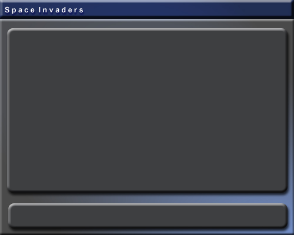



## A Cool Space Invaders Game

### Description

This is a nice space invaders game I made in my spare time. I didn't add any function to keep the frame rate down for faster computers, but I added a text box where you type in a delay (in milliseconds) to keep the speed of the game down on faster computers. To play, use all the arrow keys to go up, down, left, & right and use the space bar to shoot. Over time, if you have enough kills, you will start to get special powers :)
 
### More Info
 

             |
---                |---
**Submitted On**   |2002-06-25 21:00:56
**By**             |[Matt Carpenter](https://github.com/Planet-Source-Code/PSCIndex/blob/master/ByAuthor/matt-carpenter.md)
**Level**          |Advanced
**User Rating**    |4.8 (19 globes from 4 users)
**Compatibility**  |VB 6\.0
**Category**       |[Games](https://github.com/Planet-Source-Code/PSCIndex/blob/master/ByCategory/games__1-38.md)
**World**          |[Visual Basic](https://github.com/Planet-Source-Code/PSCIndex/blob/master/ByWorld/visual-basic.md)
**Archive File**   |[A\_Cool\_Spa989216262002\.zip](https://github.com/Planet-Source-Code/matt-carpenter-a-cool-space-invaders-game__1-36283/archive/master.zip)

